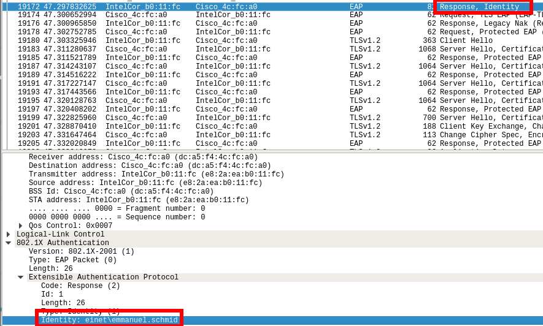
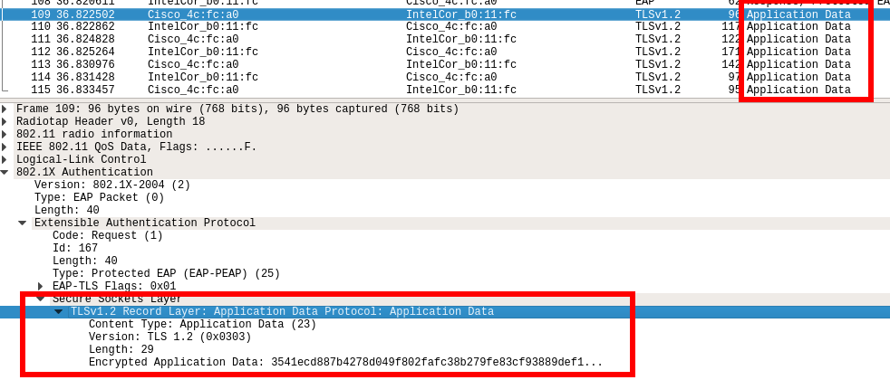
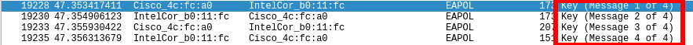

# Sécurité des réseaux sans fil - Laboratoire WPA2 Entreprise

Authors : Emmanuel Schmid and Théo Gallandat

## 1. Capture et analyse d’une authentification WPA Entreprise

### Comparer votre capture au processus d’authentification expliqué en classe

Identifier le canal utilisé par l’AP dont la puissance est la plus élevée.
Vous pouvez fairececi avec airodump-ng, par exemple

### Requête et réponse d’authentification système ouvert

### Requête et réponse d’association

### Sélection de la méthode d’authentification

### Phase d’initiation.
> Arrivez-vous à voir l’identité du client ?

### Phase hello
#### Client

> * Version TLS 
* Suites cryptographiques et méthodes de compression proposées par le client et acceptées par l’AP
* Nonces
* Session ID

#### Serveur

> * Version TLS
* Suites cryptographiques et méthodes de compression proposées par le client et acceptées par l’AP
* Nonces
* Session ID

### Phase de transmission de certificats
* Certificat serveur

* Change cipher spec

### Authentification interne et transmission de la clé WPA 
(échange chiffré, vucomme « Application data »)

### 4 way hadshake

### Questions

1. Quelle ou quelles méthode(s) d’authentification est/sont proposé(s) au client ? 
> * EAP-TLS
* EAP-PEAP

2. Quelle méthode d’authentification est utilisée ?
> * EAP-PEAP

3. Lors de l’échange de certificats entre le serveur d’authentification et le client :

  * Le serveur envoie un certificat au client ? Oui

  * Le client envoie un certificat au serveur ? Non

  c. Les deux s’échangent des certificats ? Non

## 2. Attaque WPA Entreprise

4. Quelles modifications sont nécessaires dans la configuration de hostapd-wpe pour cette attaque ?
> Choisir le SSID souhaité
5. Quel type de hash doit-on indiquer à john pour craquer le handshake ?
> NTLM ?
6. Quelles méthodes d’authentification sont supportées par hostapd-wpe ?
* EAP-FAST/MSCHAPv2 (Phase 0)
* PEAP/MSCHAPv2
* EAP-TTLS/MSCHAPv2
* EAP-TTLS/MSCHAP
* EAP-TTLS/CHAP
* EAP-TTLS/PA
